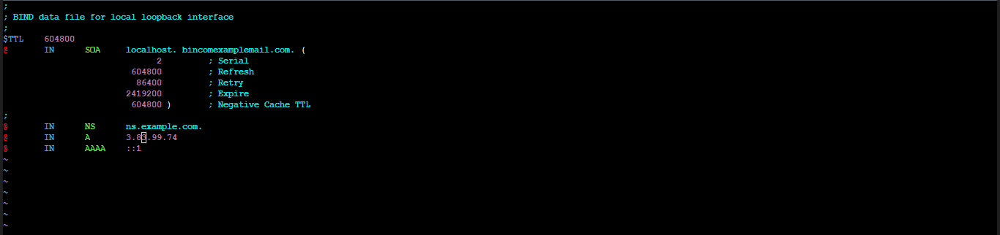
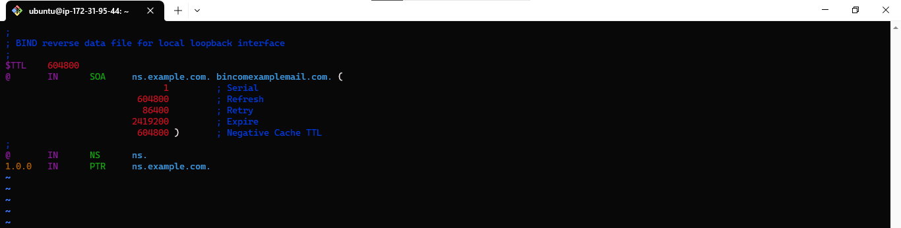
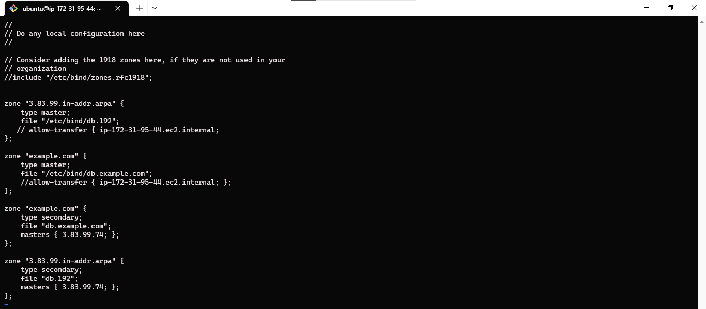
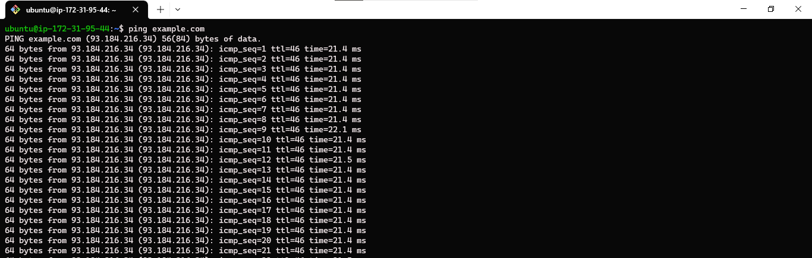
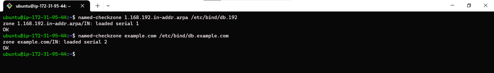

## **How to Install and Set Up DNS Server on Ubuntu Version 20.04 LTS 0r Higher**

## **Domain Name Service (DNS)**

DNS servers are computers that store and manage DNS records. These records contain the IP addresses associated with domain names. When a user types a domain name into a web browser, the browser sends a query to a DNS server. The DNS server then returns the IP address for the domain name, and the browser uses this address to connect to the website.

Ubuntu ships with BIND, the most common program used for maintaining DNS servers on Linux. BIND is a powerful and reliable DNS server that can be used to manage DNS records for a variety of domains.

Here are some additional details about DNS:

- DNS is a hierarchical system. This means that domain names are divided into zones, and each zone is managed by a different DNS server.
  
- DNS is a distributed system. This means that there are many DNS servers located all over the world. When a user types a domain name into a web browser, the browser will query the closest DNS server to its location.
  
- DNS is a critical part of the internet. Without DNS, it would be impossible for users to access websites and other online resources by typing in familiar names.

# **Requirements to install DNS Server**

- Ubuntu 20.04 0r higher
- bind9
- dnsutils

## **Step 1: Installatioon**

To install DNS Server, firstly, update your machine and then, install `bind9` and `dnsutils` using the following command:

    sudo apt update; sudo apt isnatll bind9 -y; sudo apt install dnsutils -y

`dnsutils` is a very useful package for testing and troubleshooting DNS issues.

## **Step 2: Configuration**

BIND9 can be configured in many ways to meet the needs of different organizations. Some of the most common configurations are:

- ## **Caching nameserver:** 
  A caching nameserver stores copies of DNS records in its cache. When a client computer requests a DNS record, the caching nameserver checks its cache to see if it has the record. If it does, it returns the record to the client computer. If it does not have the record, it queries another DNS server for the record and then returns the record to the client computer.

    The default configuration acts as a caching server. Simply uncomment and edit `/etc/bind/named.conf.options` to set the IP addresses of your ISP’s DNS servers:

        forwarders {
        3.85.25.173; # IP Addresses of actual nameservers
        };

    
  
- ## **Primary server:** 
  
    A primary server is the authoritative source for DNS records for a particular domain. When a client computer requests a DNS record for a domain that is managed by a primary server, the primary server returns the record to the client computer.

    - ## **Forward Zone File**
  
        To add a DNS zone to BIND9, turning BIND9 into a Primary server, first edit `/etc/bind/named.conf.local`:

            zone "example.com" {
                type master;
                file "/etc/bind/db.example.com";
            };

        

    - Now use an existing zone file as a template to create the `/etc/bind/db.example.com` file:

            sudo cp /etc/bind/db.local /etc/bind/db.example.com

    - Edit the new zone file `/etc/bind/db.example.com` and change localhost. to the Fully qualified domain name (FQDN) of your server, leaving the additional . at the end. Change 127.0.0.1 to the nameserver’s IP Address and root.localhost to a valid email address, but with a . instead of the usual @ symbol, again leaving the . at the end. Change the comment to indicate the domain that this file is for. Create an A record for the base domain, example.com. Also, create an A record for ns.example.com, the name server in this example:

                ;
            ; BIND data file for example.com
            ;
            $TTL    604800
            @       IN      SOA     example.com. root.example.com. (
                                        2         ; Serial
                                    604800         ; Refresh
                                    86400         ; Retry
                                    2419200         ; Expire
                                    604800 )       ; Negative Cache TTL

            @       IN      NS      ns.example.com.
            @       IN      A       3.85.25.173
            @       IN      AAAA    ::1

      

         BIND9 needs to be restarted for the changes to take effect:

            sudo systemctl restart bind9.service

     - ## **Reverse Zone File**
  
        Now that the zone is setup and resolving names to IP Addresses, a Reverse zone needs to be added to allows DNS to resolve an address to a name.

        Edit `/etc/bind/named.conf.local` and add the following:

            zone "3.85.25.in-addr.arpa" {
                type master;
                file "/etc/bind/db.192";
            };

        

        Create the `/etc/bind/db.192` file:

            sudo cp /etc/bind/db.127 /etc/bind/db.192

        Next edit /etc/bind/db.192 changing the same options as `/etc/bind/db.example.com`:

            ;
            ; BIND reverse data file for local 3.85.25.XXX net
            ;
            $TTL    604800
            @       IN      SOA     ns.example.com. root.example.com. (
                                        2         ; Serial
                                    604800         ; Refresh
                                    86400         ; Retry
                                    2419200         ; Expire
                                    604800 )       ; Negative Cache TTL
            ;
            @       IN      NS      ns.
            10      IN      PTR     ns.example.com.

        

        Restart BIND9:

            sudo systemctl restart bind9.service

- ## **Secondary server:**
  A secondary server is a backup for a primary server. Secondary servers store copies of the DNS records from the primary server. If the primary server is unavailable, the secondary server can be used to provide DNS services for the domain.

  The best configuration for a particular organization will depend on its needs. For example, an organization with a small number of computers may only need a caching nameserver. An organization with a large number of computers and a critical need for reliable DNS services may need to use a primary server and secondary server.

  A Secondary Server is highly recommended in order to maintain the availability of the domain should the Primary become unavailable.

  First, on the Primary server, the zone transfer needs to be allowed. Add the allow-transfer option to the example Forward and Reverse zone definitions in `/etc/bind/named.conf.local`:

        zone "example.com" {
            type master;
            file "/etc/bind/db.example.com";
          ##  allow-transfer { ip-172-31-95-44.ec2.internal; };
        };
            
        zone "1.168.192.in-addr.arpa" {
            type master;
            file "/etc/bind/db.192";
         ##   allow-transfer { ip-172-31-95-44.ec2.internal; };
        };

    Restart BIND9:

        sudo systemctl restart bind9.service

    Next, on the Secondary server, install the bind9 package the same way as on the Primary. Then edit the /etc/bind/named.conf.local and add the following declarations for the Forward and Reverse zones:

        zone "example.com" {
            type secondary;
            file "db.example.com";
            masters { 3.85.25.173; };
        };        
                
        zone "1.168.192.in-addr.arpa" {
            type secondary;
            file "db.192";
            masters { 3.85.25.173; };
        };

    

    Restart BIND9:

        sudo systemctl restart bind9.service

## **Step 3: Testing**

- ## **ping**
  Use the ping utility to send an ICMP echo request:

        ping example.com

    

- ## **named-checkzone**
  A great way to test your zone files is by using the named-checkzone utility installed with the bind9 package. This utility allows you to make sure the configuration is correct before restarting BIND9 and making the changes live.

        ## To test our example Forward zone file enter the following from a command prompt:

        named-checkzone example.com /etc/bind/db.example.com

  If everything is configured correctly you should see output similar to:

  zone example.com/IN: loaded serial 6
  OK

        ## Similarly, to test the Reverse zone file enter the following:

        named-checkzone 1.168.192.in-addr.arpa /etc/bind/db.192

    The output should be similar to:

    zone 1.168.192.in-addr.arpa/IN: loaded serial 3
    OK

    

## **Credits**

<a href="https://ubuntu.com/server/docs/service-domain-name-service-dns"><b>Ubuntu Server tutorials</b></a>

